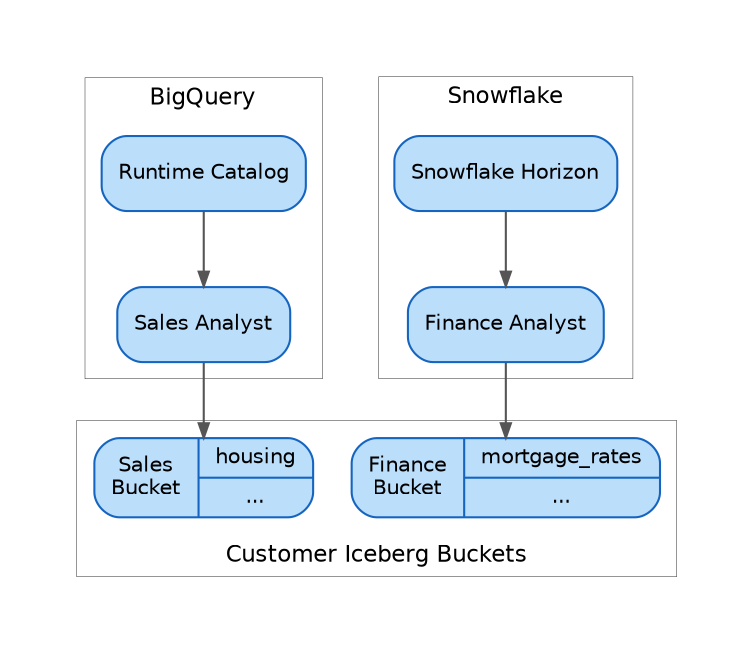
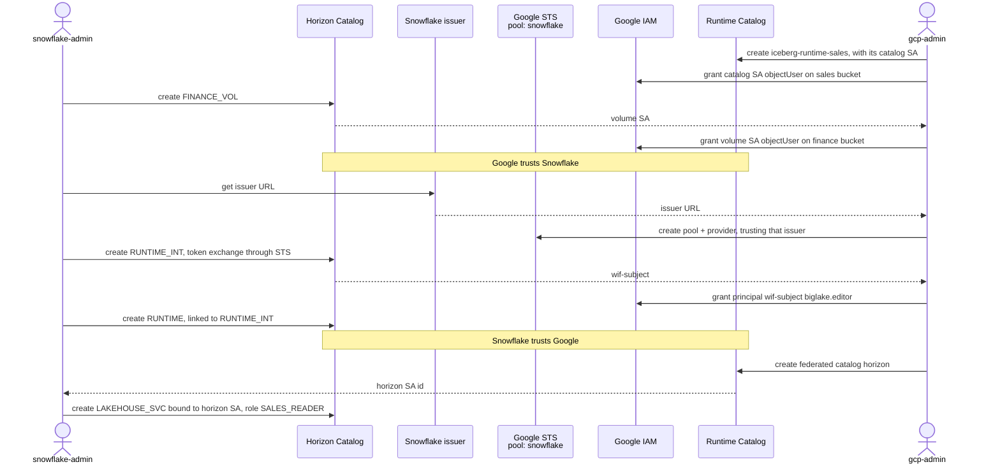
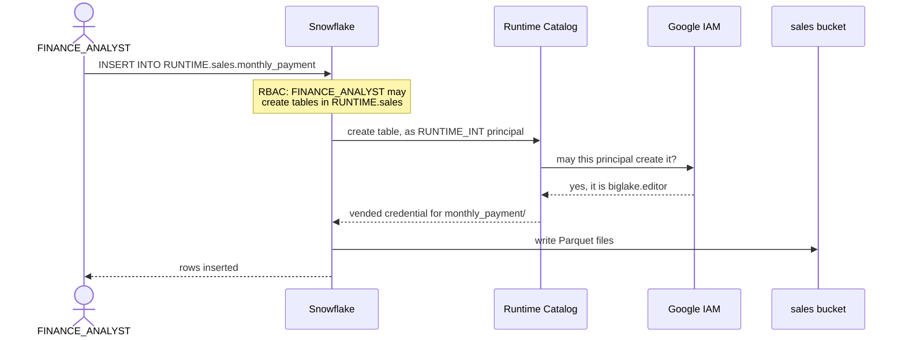
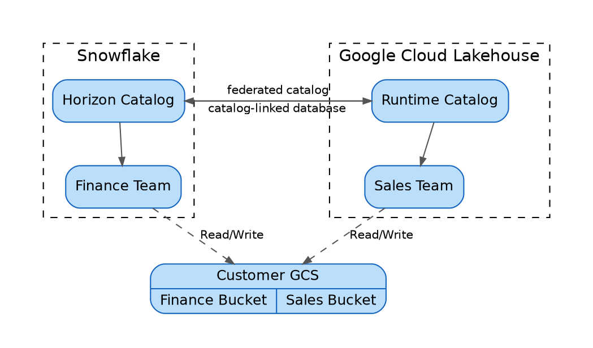

# Federated Lakehouse<br/>Google and Snowflake

This guide implements a modern data platform on the Apache Iceberg ecosystem. It covers the what, the why, and the how, briefly. It follows in the footsteps of our [Iceberg blog](../input/iceberg-blog-post.md) as an implementation and a scaffold. The code is for the Snowflake and Google Cloud joint offering, but the concepts and the workflow are a generic example of a federated lakehouse.

In our example, two teams from different departments each work natively in the engine of their choice: Snowflake for finance, BigQuery for sales. Through the federated lakehouse, Iceberg tables appear, behave, talk, and perform like native tables for both teams, without compromising security or governance.

The finance team works in Snowflake and has created the `mortgage_rates` table. It gets a request from sales to create a `monthly_payment` table. The sales team works in BigQuery and has created the `housing` table, which holds the median home value per state and year.

Let's forget for a moment who works with what. If everything were local, how would you organize it?

> The finance analyst, who has the expertise to calculate `monthly_payment`, would reach into the `sales` bucket and write there. This way, the data sits closest to its consumer, `sales`, in its logical schema alongside its related tables: `runtime.sales.{housing, monthly_payment}`.

We can do the same across teams, tools, and platforms with a federated lakehouse on Apache Iceberg.

It is an incredibly powerful architecture for neat, logical data governance, and it follows the principles of modern data architecture: no ETL, no data copies, data ownership by customer, distributed compute, and federation across tools and platforms.

To reach this data heaven, we need a shared language for data, trust between catalogs, security in access, and performance in operations:
- **Iceberg**: Store data in one format, Iceberg, so both sides speak the same language.
- **Federation**: Snowflake Horizon Catalog and the Google Cloud Lakehouse runtime catalog set up trust and a handshake through "catalog federation".
- **Direct Access**: For native performance, Snowflake and BigQuery work directly on the data files in the customer's bucket.
- **Security**: The catalog that owns a table checks permissions and vends short-lived credentials.
- **Seamless Experience**: Once the federated lakehouse is set up, the `finance` and `sales` teams browse, read, and write tables as if they were local.

| Story | Code |
|---|---|
| [0- Teams and Roles](#0--teams-and-roles) | [Teams and Roles Code](#teams-and-roles-code) |
| [1- Format: Iceberg Tables](#1--format-iceberg-tables) | [Iceberg Tables Code](#iceberg-tables-code) |
| [2- Trust: Catalog Federation](#2--trust-catalog-federation) | [Catalog Federation Code](#catalog-federation-code) |
| [3- Security: Vended Credentials](#3--security-vended-credentials) | None |
| [4- User Experience: Cross Catalog Operations](#4--user-experience-cross-catalog-operations) | [Cross Catalog Operations Code](#cross-catalog-operations-code) |
| [5- Use Iceberg for AI](#5--use-iceberg-for-ai) | [Use Iceberg for AI Code](#use-iceberg-for-ai-code) |


## 0- Teams and Roles

All data sits as Apache Iceberg in the customer's own Cloud Storage buckets. Every engine talks Iceberg REST Catalog, and then reads and writes the files directly. No copies. No ETL.

| Persona | Surface | Identity | Does |
|---|---|---|---|
| **gcp-admin** | `gcloud` | Project Owner | Buckets, Runtime Catalog, workload identity federation, IAM, federated catalog |
| **snowflake-admin** | Snowflake SQL | `ACCOUNTADMIN` | Role, external volume, catalog integration, catalog-linked database, service user |
| **finance-analyst** | Snowflake SQL | `FINANCE_ANALYST` | Owns `mortgage_rates`, reads `housing`, writes `monthly_payment` |
| **sales-analyst** | BigQuery SQL | Google user with `biglake.editor` and `bigquery.jobUser` | Owns `housing`, reads `mortgage_rates`, joins both |

Snowflake gets one more role, `SALES_READER`. It belongs to no person. It is what Horizon shows to the Google federated catalog: read on `HORIZON.FINANCE`, nothing else.


- The sales team
    creates the `housing` Iceberg table in BigQuery. Its Apache Iceberg tables are managed by the Google Cloud Lakehouse runtime catalog (Runtime Catalog from here on). `housing` holds the median value of owner-occupied homes per state and year, from the Census American Community Survey.

- The finance team
    creates the `mortgage_rates` Iceberg table in Snowflake, which uses Snowflake Horizon Catalog. It holds the weekly US average 30-year fixed rate since 1971, from Freddie Mac.

Three distinctions matter here:
- The physical files sit in the customer's bucket. The customer owns the data and the metadata.
- Each team freely picks its own native catalog: Horizon for finance, the Runtime Catalog for sales and the rest of Google Cloud.
- The customer delegates the governance layer to those trusted catalogs, and keeps ownership of what is on disk.

This is the pillar of a federated lakehouse: true interoperability, without handing the keys away.



First, let's set up the buckets and roles.

> [Go to code: Teams and Roles](#teams-and-roles-code)


## 1- Format: Iceberg Tables

Now each team creates its Iceberg table in its own workspace:

- In Snowflake, using the Snowflake **finance-analyst** role, create the `mortgage_rates` Iceberg table in `horizon.finance` and store it in the customer's finance bucket. We get the series from the Snowflake Marketplace.

- In BigQuery, using the BigQuery **sales-analyst** identity, create the `housing` Iceberg table in `runtime.sales` and store it in the customer's sales bucket. We take five states from the Census American Community Survey.

> [Go to code: Iceberg Tables](#iceberg-tables-code)

Open the [Google Cloud console](https://console.cloud.google.com) for the project. In both buckets, we can see the `.parquet` data files and the `.json` metadata files. The customer owns the data and metadata, but the complexity is delegated to, and done securely by, the trusted catalogs of choice: the Runtime Catalog and Snowflake Horizon.


## 2- Trust: Catalog Federation

Each team now has its own table. That is not yet a lakehouse. `finance-analyst` still cannot see `housing`. `sales-analyst` still cannot see `mortgage_rates`. The catalogs do not know each other.

Federation is the reach: each catalog attaches to the other through Iceberg REST, stays in sync, and presents the remote tables as if they were local.

We need to build trust between our `runtime` and `horizon` catalogs. First, the GCP admin trusts this Snowflake account: a workload identity pool whose OIDC issuer is this Snowflake account maps the catalog integration to one Google principal.

- Snowflake is given a door into the Runtime Catalog: a catalog integration to the Runtime Catalog Iceberg REST endpoint, using that pool, with vended credentials. Then a **catalog-linked database** named `runtime`, so `runtime.sales` is just another schema to `finance-analyst` in Snowflake.

- Google is given a door into Horizon: a **Lakehouse federated catalog** pointed at Horizon's Iceberg REST endpoint. The catalog's Google identity is bound to a dedicated Snowflake service user and role. Then `horizon.finance` is just another dataset to `sales-analyst`.

No password. No PAT in a file. No standing key on either bucket. A dedicated identity on each side, granted only what that side's catalog should see.



Let's do that:

- In Snowflake, attach the Runtime Catalog as the linked database `runtime`, so `runtime.sales.housing` is just another table to `finance-analyst`.
- In Google Cloud Lakehouse, attach Horizon as the federated catalog `horizon`, so `horizon.finance.mortgage_rates` is just another table to `sales-analyst`.

> [Go to code: Catalog Federation](#catalog-federation-code)

Now both teams see every Iceberg table in their own workspace, no matter who manages it or where the files live. Because `runtime` and `horizon` trust each other, each vends short-lived credentials to the other: bidirectional interoperability without compromising security or governance.

> After this step, the BigQuery sales-analyst can read `horizon.finance`. Writing into Horizon from BigQuery is not available yet (see [4.4- BigQuery Writes to Snowflake](#44--bigquery-writes-to-snowflake)).


## 3- Security: Vended Credentials

Most of what follows is one motion: an analyst asks for a table, the owner catalog vends a short-lived credential, and the engine talks to the files.

Let's follow one operation — `finance-analyst` writes `monthly_payment` into `runtime.sales` — so the reads and writes ahead do not have to retell it.

- `finance-analyst` runs an insert in Snowflake. To that role, `runtime.sales` already looks like a local schema. Snowflake is the one that knows it lives on the other side, behind `RUNTIME_INT`, and it manages the complexity behind the scenes.
- Snowflake presents a short-lived Snowflake ID token. Google already trusts that issuer (the pool from the last step), and exchanges it for a Google access token mapped to one principal.
- The Runtime Catalog sees the principal and asks IAM: may this identity create `monthly_payment`? If yes, it vends a second short-lived credential, minted from its own service account and scoped to the folder of `monthly_payment` in the sales bucket.
- Snowflake writes the Parquet files straight into that folder with the vended credential, and Cloud Storage checks the token. Then Snowflake commits the new snapshot to the Runtime Catalog. The Runtime Catalog is not in the path of each file: Snowflake works directly on the data files of the sales team.





As you noticed, these are short-lived **vended credentials**, issued by the trusted owner of the table. There is no exchange of a bucket key, a password, or any long-lived token. IAM checks the federated principal; Cloud Storage checks the vended credential. The engine reads or writes the files directly. The owner catalog stays in the path only for "what is this table", "you may touch it", and the commit.

The walk the other way is the same motion with the seats swapped. `sales-analyst` asks BigQuery for a finance table. The Lakehouse federated catalog presents a Google identity to Horizon. Horizon checks the Snowflake role and policies, vends a short-lived credential for the finance bucket, and BigQuery reads the files.


## 4- User Experience: Cross Catalog Operations

Everything is set up: buckets, roles, Iceberg tables, catalog trust, and vended credentials. The federated lakehouse is ready. From here on, both teams run their daily reads and writes as if every table were local, no matter where it sits or who manages it. Each table is docked in both workspaces.




With Iceberg, the first goal is zero data copy. Each engine reads straight from the source files in the customer's bucket, so in theory and in practice there is no performance hit. A free data lunch.

> We do not cover performance measurements, but both teams report near-identical performance compared to their native tables.

Nothing is copied. Each engine asks the owner catalog what exists and who may touch it. In Snowflake, the two catalogs show up as two databases. In BigQuery, the Runtime Catalog is home, and Horizon arrives as the federated one.

Reading is half the story. Sales asks finance for a typical monthly mortgage payment on a median home, per state and year. Finance calculates it and stores it as `monthly_payment` in `runtime.sales`, because that result *belongs* with the sales team's housing data.

That is another advantage of the federated Iceberg lakehouse: you write the table where it should live *logically*, not where the writer's engine happens to sit.

In older data platforms, the physical constraint — who owns the files, who holds the key — dictated where a table could be written. The result was a tangled web of data objects.

We can write it in the right place because, at the moment of the operation, the trusted catalog that owns the destination table vends a short-lived credential for just those files. That is the [security walk](#3--security-vended-credentials) above.

Let's do it. From each team's workspace, read the other side's table, then write across.

### 4.1- Snowflake Reads BigQuery

`finance-analyst` selects from `runtime.sales.housing`. Same SQL as a local table.

> [Go to code: Snowflake Reads BigQuery](#snowflake-reads-bigquery-code)

### 4.2- BigQuery Reads Snowflake

`sales-analyst` selects from `horizon.finance.mortgage_rates`. Same SQL as a local table.

> [Go to code: BigQuery Reads Snowflake](#bigquery-reads-snowflake-code)


### 4.3- Snowflake Writes to BigQuery

`finance-analyst` joins `horizon.finance.mortgage_rates` to `runtime.sales.housing` and writes `monthly_payment` into `runtime.sales`. Nothing in the query shows that two catalogs are involved.

> [Go to code: Snowflake Writes to BigQuery](#snowflake-writes-to-bigquery-code)

### 4.4- BigQuery Writes to Snowflake

The mirror is the BigQuery sales-analyst joining the same two tables and writing into Horizon. BigQuery runs the join today; the write into Horizon is not available yet. When it lands, it is the same motion the other way: BigQuery asks Horizon, Horizon vends a credential scoped to the finance bucket, BigQuery writes the files, and Horizon commits.

> [Go to code: BigQuery Writes to Snowflake](#bigquery-writes-to-snowflake-code)


A last word, only because these will otherwise surprise you: IAM on a new principal takes a minute to land, and recreating the catalog integration mints a new subject that the grants have to follow.


## 5- Use Iceberg for AI

The tables are now present on both isles, and they behave like native tables. That is enough for an analyst. It is also enough for AI.

We will not retell the AI chapter of the [blog](../input/iceberg-blog-post.md). One semantic view across both catalogs is the point.

`finance-analyst` describes the business once, in a semantic view: `monthly_payment` from the Runtime Catalog, `mortgage_rates` from Horizon, their dimensions, and their metrics. It lives in `horizon.finance` as `housing_cost_semantic_view`.

Then, in **Cortex Code**, ask in plain language:

> Using `HORIZON.FINANCE.HOUSING_COST_SEMANTIC_VIEW`, what was the monthly payment by state in 2023?

> Using `HORIZON.FINANCE.HOUSING_COST_SEMANTIC_VIEW`, what was the average mortgage rate per year since 2020?

Cortex Code reads the semantic view, writes the SQL across both catalogs, and answers. Horizon and the Runtime Catalog still vend the credentials. Governance does not change because the asker is AI instead of a person.

Two isles. One copy of the files. One semantic view.

> [Go to code: Use Iceberg for AI](#use-iceberg-for-ai-code)

---

# Code

Finance works in Snowflake on **Horizon Catalog**. Sales works in BigQuery on the **Lakehouse runtime catalog** of Google Cloud **Lakehouse for Apache Iceberg** (Runtime Catalog from here on). Both tables sit in the customer's own Cloud Storage buckets. One copy of the files, six operations, no passwords.

## Teams and Roles Code


### Buckets, Catalogs, and Roles

Before we start, find and replace these five on the whole page. Values in `<angle brackets>` come from the step before.

| Token | Meaning |
|---|---|
| `my-project` | Google Cloud project id |
| `MYORG-MYACCOUNT` | Snowflake account identifier |
| `us-central1` | Region of the Snowflake account, from `SELECT CURRENT_REGION()` |
| `iceberg-horizon-finance` | Finance bucket |
| `iceberg-runtime-sales` | Sales bucket, also the id of its Runtime Catalog |

Bucket names are global. If these are taken, pick your own.

You also need the free **Snowflake Public Data (Free)** listing from Snowflake Marketplace, Cloud SDK 588 or newer, and a warehouse named `COMPUTE_WH`.


**gcp-admin** creates both buckets and the sales Runtime Catalog, and gives the sales analyst its access.

```bash
gcloud config set project my-project
gcloud services enable biglake.googleapis.com iam.googleapis.com sts.googleapis.com

gcloud storage buckets create gs://iceberg-horizon-finance gs://iceberg-runtime-sales \
  --location=us-central1 --uniform-bucket-level-access

gcloud biglake iceberg catalogs create iceberg-runtime-sales \
  --catalog-type=gcs-bucket --credential-mode=vended-credentials
gcloud biglake iceberg namespaces create sales --catalog=iceberg-runtime-sales

RUNTIME_SA=$(gcloud biglake iceberg catalogs describe iceberg-runtime-sales \
  --format='value(biglake-service-account)')
gcloud storage buckets add-iam-policy-binding gs://iceberg-runtime-sales \
  --member="serviceAccount:$RUNTIME_SA" --role=roles/storage.objectUser

for ROLE in biglake.editor bigquery.jobUser; do
  gcloud projects add-iam-policy-binding my-project \
    --member="user:$(gcloud config get-value account)" --role=roles/$ROLE
done
```

**snowflake-admin** creates the finance role, the volume, and the Horizon database. Paste `STORAGE_GCP_SERVICE_ACCOUNT` to gcp-admin.

```sql
USE ROLE ACCOUNTADMIN;

CREATE ROLE FINANCE_ANALYST;
SET ME = CURRENT_USER();
GRANT ROLE FINANCE_ANALYST TO USER IDENTIFIER($ME);

CREATE EXTERNAL VOLUME FINANCE_VOL
  STORAGE_LOCATIONS = ((NAME = 'finance' STORAGE_PROVIDER = 'GCS'
                        STORAGE_BASE_URL = 'gcs://iceberg-horizon-finance/'))
  ALLOW_WRITES = TRUE;
DESC EXTERNAL VOLUME FINANCE_VOL;

CREATE DATABASE HORIZON;
GRANT USAGE, CREATE SCHEMA ON DATABASE HORIZON TO ROLE FINANCE_ANALYST;
GRANT USAGE ON EXTERNAL VOLUME FINANCE_VOL TO ROLE FINANCE_ANALYST;
GRANT USAGE ON WAREHOUSE COMPUTE_WH TO ROLE FINANCE_ANALYST;
GRANT IMPORTED PRIVILEGES ON DATABASE SNOWFLAKE_PUBLIC_DATA_FREE TO ROLE FINANCE_ANALYST;
```

**gcp-admin** lets that one service account use the finance bucket.

```bash
for ROLE in storage.objectUser storage.legacyBucketReader; do
  gcloud storage buckets add-iam-policy-binding gs://iceberg-horizon-finance \
    --member='serviceAccount:<volume-sa>' --role=roles/$ROLE
done
```

> [Back to story: 1- Format: Iceberg Tables](#1--format-iceberg-tables)

## Iceberg Tables Code

**finance-analyst** creates its own schema and `mortgage_rates` in Horizon: the weekly Freddie Mac 30-year fixed rate since 1971.

```sql
USE ROLE FINANCE_ANALYST;
USE WAREHOUSE COMPUTE_WH;

CREATE SCHEMA HORIZON.FINANCE;
CREATE ICEBERG TABLE HORIZON.FINANCE.MORTGAGE_RATES
  CATALOG = 'SNOWFLAKE' EXTERNAL_VOLUME = 'FINANCE_VOL' BASE_LOCATION = 'mortgage_rates'
AS SELECT DATE AS OBS_DATE, VALUE * 100 AS RATE
   FROM SNOWFLAKE_PUBLIC_DATA_FREE.PUBLIC_DATA_FREE.FREDDIE_MAC_HOUSING_TIMESERIES
   WHERE VARIABLE = 'FRM_30_YR' AND GEO_ID = 'country/USA';
```

**sales-analyst** creates `housing` in the Runtime Catalog: the 2023 ACS 1-year median owner-occupied home value (`B25077`) for CA, FL, HI, NY, and TX.

```sql
CREATE TABLE `my-project`.`iceberg-runtime-sales.sales`.housing
  (geo_id STRING, year INT64, home_value FLOAT64);

INSERT INTO `my-project`.`iceberg-runtime-sales.sales`.housing VALUES
  ('geoId/06', 2023, 725800), ('geoId/12', 2023, 381000), ('geoId/15', 2023, 846400),
  ('geoId/36', 2023, 420200), ('geoId/48', 2023, 296900);
```

> [Back to story: 1- Format: Iceberg Tables](#1--format-iceberg-tables)

## Catalog Federation Code

No password, no PAT, no bucket key. Each side trusts the other's identity, and each catalog vends short-lived credentials for its own files.

**gcp-admin** trusts this Snowflake account. The issuer comes from snowflake-admin: `SELECT SYSTEM$GET_WORKLOAD_IDENTITY_ISSUER_URL();`

```bash
gcloud iam workload-identity-pools create snowflake --location=global
gcloud iam workload-identity-pools providers create-oidc snowflake \
  --location=global --workload-identity-pool=snowflake \
  --issuer-uri='<issuer-url>' --attribute-mapping='google.subject=assertion.sub'

PN=$(gcloud projects describe my-project --format='value(projectNumber)'); echo "$PN"
```

**snowflake-admin** opens Snowflake's door into the Runtime Catalog. Paste `WORKLOAD_IDENTITY_FEDERATION_SUBJECT` to gcp-admin.

```sql
USE ROLE ACCOUNTADMIN;

CREATE CATALOG INTEGRATION RUNTIME_INT
  CATALOG_SOURCE = ICEBERG_REST
  TABLE_FORMAT = ICEBERG
  REST_CONFIG = (
    CATALOG_URI = 'https://biglake.googleapis.com/iceberg/v1/restcatalog'
    CATALOG_NAME = 'gs://iceberg-runtime-sales'
    ACCESS_DELEGATION_MODE = VENDED_CREDENTIALS
    ADDITIONAL_HEADERS = ("x-goog-user-project" = 'my-project'))
  REST_AUTHENTICATION = (
    TYPE = OAUTH
    OAUTH_GRANT_TYPE = TOKEN_EXCHANGE
    OAUTH_TOKEN_URI = 'https://sts.googleapis.com/v1/token'
    OAUTH_AUDIENCE = '//iam.googleapis.com/projects/<PN>/locations/global/workloadIdentityPools/snowflake/providers/snowflake'
    OAUTH_ALLOWED_SCOPES = ('https://www.googleapis.com/auth/bigquery'))
  ENABLED = TRUE;
DESC CATALOG INTEGRATION RUNTIME_INT;
```

**gcp-admin** grants that one subject on the Runtime Catalog, then opens Google's door into Horizon. Paste `biglake-service-account-id` to snowflake-admin.

```bash
MEMBER="principal://iam.googleapis.com/projects/$PN/locations/global/workloadIdentityPools/snowflake/subject/<wif-subject>"
for ROLE in biglake.editor serviceusage.serviceUsageConsumer; do
  gcloud projects add-iam-policy-binding my-project --member="$MEMBER" --role=roles/$ROLE
done

# --snowflake-warehouse is the Horizon database, not a Snowflake warehouse.
gcloud biglake iceberg catalogs create horizon \
  --catalog-type=federated --federated-catalog-type=snowflake \
  --snowflake-account-identifier=MYORG-MYACCOUNT \
  --snowflake-warehouse=HORIZON --snowflake-role=SALES_READER \
  --primary-location=us-central1 --refresh-interval=300s
gcloud biglake iceberg catalogs describe horizon --format='value(biglake-service-account-id)'
```

**snowflake-admin** links the Runtime Catalog as the `RUNTIME` database, binds the federated catalog's Google identity to a read-only service user, and lets finance into `RUNTIME.sales`.

```sql
USE ROLE ACCOUNTADMIN;

CREATE DATABASE RUNTIME LINKED_CATALOG = (CATALOG = 'RUNTIME_INT');

CREATE ROLE SALES_READER;
GRANT USAGE ON DATABASE HORIZON TO ROLE SALES_READER;
GRANT USAGE ON SCHEMA HORIZON.FINANCE TO ROLE SALES_READER;
GRANT SELECT ON ALL ICEBERG TABLES IN SCHEMA HORIZON.FINANCE TO ROLE SALES_READER;

CREATE USER LAKEHOUSE_SVC TYPE = SERVICE DEFAULT_ROLE = SALES_READER
  WORKLOAD_IDENTITY = (TYPE = GCP SUBJECT = '<horizon-sa-id>');
GRANT ROLE SALES_READER TO USER LAKEHOUSE_SVC;

-- Discovery syncs sales.housing into RUNTIME within 30 seconds; grant after it lands.
GRANT USAGE ON DATABASE RUNTIME TO ROLE FINANCE_ANALYST;
GRANT USAGE, CREATE ICEBERG TABLE ON SCHEMA RUNTIME.sales TO ROLE FINANCE_ANALYST;
GRANT SELECT ON ALL ICEBERG TABLES IN SCHEMA RUNTIME.sales TO ROLE FINANCE_ANALYST;
```

The federated catalog picks up `FINANCE.MORTGAGE_RATES` on its next refresh, five minutes at most.

> [Back to story: 2- Trust: Catalog Federation](#2--trust-catalog-federation)

## Cross Catalog Operations Code

### Snowflake Reads BigQuery Code

**finance-analyst** reads `housing`.

```sql
SELECT * FROM RUNTIME.sales.housing WHERE year = 2023;
```

> [Back to story: 4.2- BigQuery Reads Snowflake](#42--bigquery-reads-snowflake)

### BigQuery Reads Snowflake Code

**sales-analyst** reads `mortgage_rates`.

```sql
SELECT OBS_DATE, RATE FROM `my-project`.`horizon.FINANCE`.MORTGAGE_RATES
ORDER BY OBS_DATE DESC LIMIT 10;
```

> [Back to story: 4.3- Snowflake Writes to BigQuery](#43--snowflake-writes-to-bigquery)

### Snowflake Writes to BigQuery Code

**finance-analyst** joins both catalogs and writes `monthly_payment` where it belongs logically: next to `housing`, in the Runtime Catalog. The payment on a median home uses a 30-year fixed loan at the year-end rate: `payment = P · r / (1 − (1 + r)^−360)`, where `r` is the annual rate in percent divided by 1200.

```sql
CREATE ICEBERG TABLE RUNTIME.sales.monthly_payment
  (geo_id STRING, year INT, home_value DOUBLE, rate DOUBLE, monthly_payment DOUBLE);

INSERT INTO RUNTIME.sales.monthly_payment
SELECT h.geo_id, h.year, h.home_value, r.rate,
       h.home_value * (r.rate / 1200) / (1 - POWER(1 + r.rate / 1200, -360))
FROM RUNTIME.sales.housing h
JOIN (SELECT YEAR(OBS_DATE) AS year, MAX_BY(RATE, OBS_DATE) AS rate
      FROM HORIZON.FINANCE.MORTGAGE_RATES GROUP BY 1) r ON r.year = h.year;
```

> [Back to story: 4.4- BigQuery Writes to Snowflake](#44--bigquery-writes-to-snowflake)

### BigQuery Writes to Snowflake Code

**sales-analyst** reads what finance wrote, then runs the same join from its own engine.

```sql
SELECT * FROM `my-project`.`iceberg-runtime-sales.sales`.monthly_payment
ORDER BY monthly_payment DESC;

SELECT h.geo_id, h.year, h.home_value, r.rate,
       h.home_value * (r.rate / 1200) / (1 - POWER(1 + r.rate / 1200, -360)) AS monthly_payment
FROM `my-project`.`iceberg-runtime-sales.sales`.housing h
JOIN (SELECT EXTRACT(YEAR FROM OBS_DATE) AS year, MAX_BY(RATE, OBS_DATE) AS rate
      FROM `my-project`.`horizon.FINANCE`.MORTGAGE_RATES GROUP BY year) r ON r.year = h.year;
```

Writing the result into Horizon is not available yet. In BigQuery, a Lakehouse federated catalog is read-only: `INSERT` and `CREATE TABLE` against `horizon` are rejected. When it lands, it is the same motion in reverse. BigQuery asks Horizon, Horizon vends a credential scoped to the finance bucket, BigQuery writes, and Horizon commits.

> [Back to story: 5- Use Iceberg for AI](#5--use-iceberg-for-ai)

## Use Iceberg for AI Code

**finance-analyst** gives Cortex Code one semantic view over both catalogs: `monthly_payment` in the Runtime Catalog and `mortgage_rates` in Horizon.

```sql
CREATE SEMANTIC VIEW HORIZON.FINANCE.HOUSING_COST_SEMANTIC_VIEW
  TABLES (
    payments AS RUNTIME.sales.monthly_payment PRIMARY KEY (geo_id, year)
      COMMENT = 'Monthly mortgage payment on a median home, per US state and year',
    rates AS HORIZON.FINANCE.MORTGAGE_RATES PRIMARY KEY (OBS_DATE)
      COMMENT = 'Weekly US average 30-year fixed mortgage rate, in percent')
  DIMENSIONS (
    payments.state AS geo_id COMMENT = 'US state as Census geoId/<FIPS code>',
    payments.payment_year AS year,
    rates.week AS OBS_DATE)
  METRICS (
    payments.monthly_payment AS AVG(monthly_payment),
    payments.home_value AS AVG(home_value),
    rates.rate AS AVG(RATE));
```

Then ask Cortex Code the two questions in [5- Use Iceberg for AI](#5--use-iceberg-for-ai).

## Optional: Network Policy

If your Snowflake account has a network policy, it must let the Google federated catalog in. Add a network rule with Google Cloud ranges to the policy:

```sql
CREATE NETWORK RULE GOOGLE_CLOUD TYPE = IPV4 MODE = INGRESS VALUE_LIST = ('<google-cloud-range>');
ALTER NETWORK POLICY <account-policy> ADD ALLOWED_NETWORK_RULE_LIST = ('GOOGLE_CLOUD');
```
